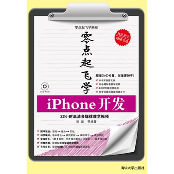

《零点起飞学习iPhone开发》 
=====================================
 
**作者：胡超** 
 
# 高清图片版 
 
 
 
# 目录 
 
* [书名](md) 
* [前言](md) 
* [目录](md) 
* [第1篇 iPhone开发基础](md) 
  * [第1章 第一个iPhone程序](md) 
  * [第2章 Objective-C语言基础](md) 
* [第2篇 iPhone界面开发](md) 
  * [第3章 视图及视图控制器](md) 
  * [第4章 操作文本内容](md) 
  * [第5章 提醒用户的操作](md) 
  * [第6章 图形图像处理](md) 
  * [第7章 使用网页](md) 
  * [第8章 表的操作](md) 
  * [第9章 使用地图服务](md) 
  * [第10章 使用选择器](md) 
  * [第11章 动画](md) 
* [第3篇 iPhone应用开发](md) 
  * [第12章 操作地址簿和电子邮件](md) 
  * [第13章 多媒体](md) 
  * [第14章 手势](md) 
   
 
# 随机光盘及PDF下载 
